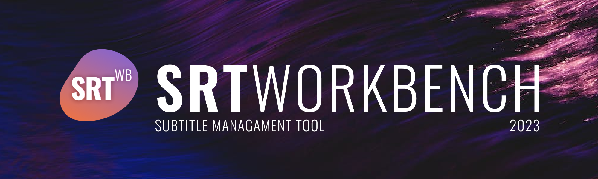
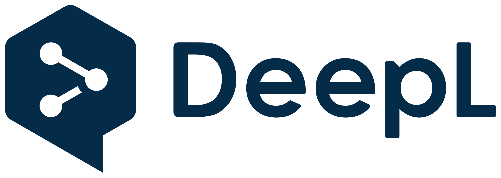

# SRTWorkbench

[](https://github.com/aglasencnik/SRTWorkbench/) 

[](https://github.com/aglasencnik/SRTWorkbench/commits/master)

[](https://github.com/aglasencnik/SRTWorkbench/releases/)

[](https://github.com/aglasencnik/SRTWorkbench/releases/)

[](https://github.com/aglasencnik/SRTWorkbench/)

[](https://github.com/aglasencnik/SRTWorkbench/)

[](https://github.com/aglasencnik/SRTWorkbench/issues)

[](https://github.com/aglasencnik/SRTWorkbench/issues)

[](https://github.com/aglasencnik/SRTWorkbench/blob/master/LICENSE.txt)

SRTWorkbench is a powerful subtitle management tool built with Windows Forms in .NET 7. It provides you the ability to manipulate SubRip (.srt) subtitle files in a variety of ways. You can translate subtitles using the DeepL API and shift the timing of subtitles either as a whole or in parts.


## Features

SRTWorkbench offers a variety of powerful features to help you manage and manipulate your .srt files:

- **DeepL API Translation:** Seamlessly translate your .srt files using the DeepL API. Our interface makes it easy to input your API keys and manage the translation process.

- **Subtitle Shifting:** With SRTWorkbench, you can easily adjust the timing of your entire subtitle file or choose specific portions to shift. This is especially useful for synchronizing your subtitles with video playback.

- **File Editing:** In the applicarion, you can also edit you .srt files easily.

We are always working to add new features and improve existing ones. Your feedback and contributions are welcome!


## Tech

- .NET 7


- DeepL




## Run Locally

Running this project locally requires .NET 7.0 SDK and Visual Studio 2023 or later.

Clone the project

```bash
  git clone https://github.com/aglasencnik/SRTWorkbench.git
```

Go to the project directory

```bash
  cd SRTWorkbench/SRTWorkbench
```

Install dependencies

```bash
  dotnet restore
```

Start the app

```bash
  dotnet run
```


## Deployment

Deploying SRTWorkbench is veery straightforward.

Here are the general steps:

```bash
  dotnet publish -c Release -o ./publish
```

This command creates a publish directory in your project root which contains the compiled project and all its dependencies.

## Authors

Application development:

- [@aglasencnik](https://www.github.com/aglasencnik)

Banner design:

- [@GalPovsod8](https://www.github.com/GalPovsod8)


## License

[MIT](https://github.com/aglasencnik/SRTWorkbench/blob/master/LICENSE.txt)


## Feedback

If you have any feedback, please reach out to us at amadej@aglasencnik.com

